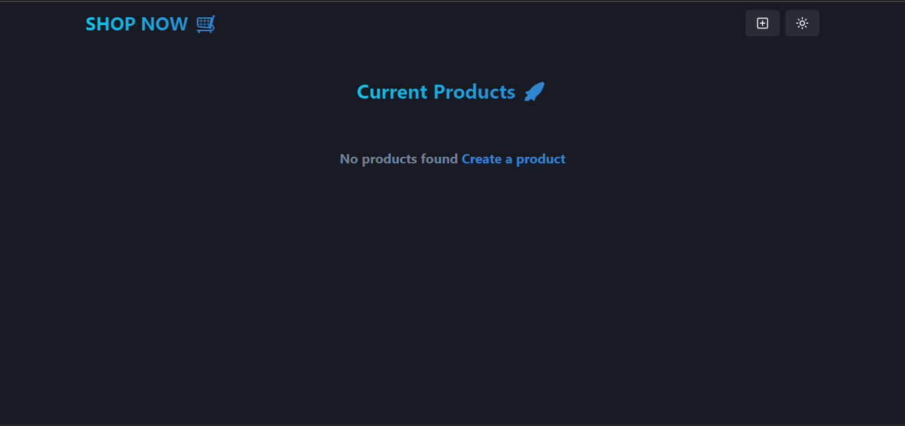
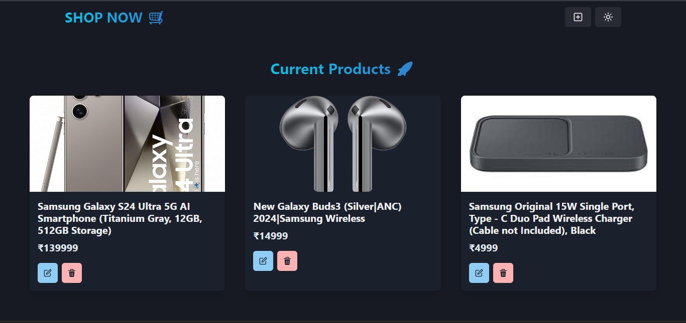

# Shop Now

A simple full-stack MERN project that lets the user insert, update, delete, and get products, along with viewing the product listing.

## Tech Stack
- **Frontend:** React.js
- **Backend:** Node.js, Express.js
- **Database:** MongoDB


### Steps to Run the Project:
1.Clone the repository:
   ```bash
   git clone https://github.com/Balaatchayar/Shop_Now.git
   ```

2.Set up environment variables:

Create a .env file in the root directory.
Add the required variables:

```bash
MONGO_URI=your_mongo_database_connection_string
PORT=5000
```

3.Start the backend server:

```bash
   cd backend
   npm run dev
   ```

4.Start the frontend server:

```bash
   cd frontend
   npm run dev
   ```






